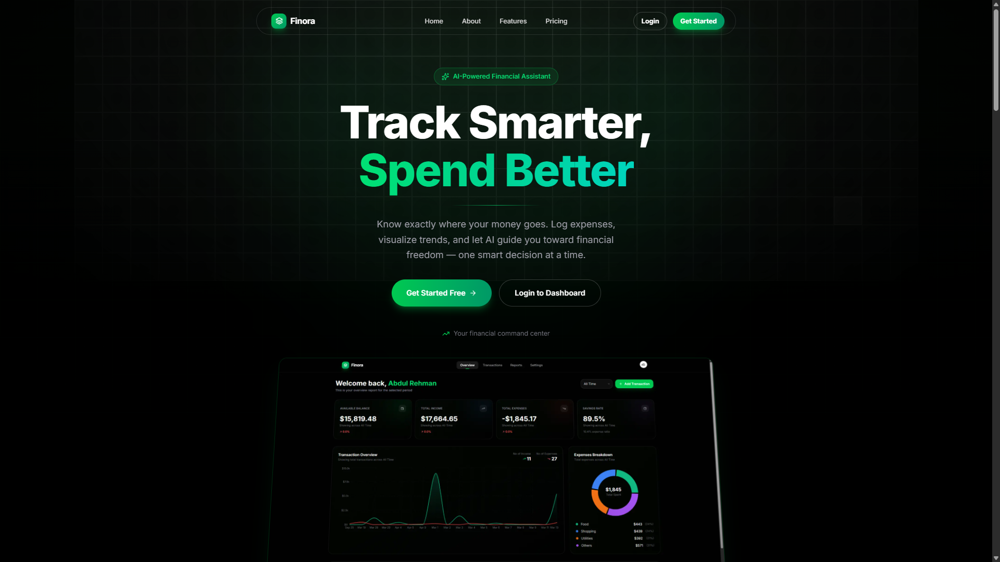

<p align="center">
  
</p>

<h1 align="center">Finora</h1>

<p align="center">
  <strong>AI-Powered Financial Assistant</strong><br />
  Track smarter. Spend better. Know exactly where your money goes.
</p>

<p align="center">
  
  
  
  
  
  
  
</p>

---

## Project Introduction

**Finora** is a full-stack, AI-powered personal finance platform that helps users log expenses, visualize spending trends, manage budgets, and receive intelligent insights — all from a modern dark-themed dashboard.

It combines a **Next.js** frontend with an **Express** backend, **Neon PostgreSQL** via Drizzle ORM, **Better Auth** for authentication, **Stripe** for Pro subscriptions, **Google Gemini** for AI analysis and chat, and **Inngest** for scheduled report delivery.

---

## About the Project

Most people know they should track money — few stick with it. Spreadsheets are tedious, bank apps are fragmented, and generic budgets don’t explain *why* spending slipped.

Finora solves that by giving users a single command center to:

- Capture income and expenses quickly (including receipt uploads and bulk import)
- See clear charts for income vs expenses and category breakdowns
- Set category budgets and get AI-written analysis saved in the database
- Chat with an AI assistant that understands their finance data
- Receive weekly or monthly email reports on a schedule

Whether you’re freelancing, managing household cash flow, or building better money habits, Finora turns raw transactions into decisions you can act on.

---

## Benefits

| Benefit | What you get |
|--------|----------------|
| **Clarity** | Balance, income, expenses, and savings rate at a glance |
| **Speed** | Fast transaction logging, filters, and bulk CSV/import flows |
| **Intelligence** | Gemini-powered budget analysis and AI chat grounded in your data |
| **Discipline** | Budgets with progress tracking and persisted AI recommendations |
| **Automation** | Recurring report emails via Inngest (weekly / monthly) |
| **Growth path** | Free plan for essentials; Pro for unlimited transactions, longer analytics ranges, and bulk import |

---

## Features

### Authentication & accounts
- Email / password and social auth via **Better Auth**
- Protected dashboard routes and session-aware API access
- User settings for profile and billing

### Dashboard overview
- Welcome header with period presets (e.g. last 7 days → all time)
- Summary cards: available balance, income, expenses, savings rate
- Transaction overview (area chart) and expense breakdown (donut)
- Recent transactions list and **Budget Status** card

### Transactions
- Full CRUD for income and expense entries
- Search, category, type, and frequency filters
- Pagination and payment-method metadata
- Recurring transaction fields (interval / next date)
- **Transaction Trend** chart (7D, 30D, 3M, Monthly, Yearly) with Pro gating
- Bulk import (Pro)
- Receipt upload via Cloudinary

### Categories
- Create and manage custom spending / income categories
- Used across transactions, budgets, and analytics

### Budgets
- Per-category budget targets with progress visualization
- **AI Analyze** — Gemini generates insights stored on each budget (`aiAnalysis`)
- Re-run analysis anytime; results persist in the database (not localStorage)

### Reports
- Generate financial reports for a period
- Report settings: enable/disable, weekly or monthly frequency, email override
- Status cards (e.g. total reports, sent, failed)
- Resend a report from stored email content
- Background delivery via **Inngest** cron + event-driven functions

### AI Chats
- Conversational finance assistant powered by LangChain + Gemini
- Chat history persisted in the database
- Tooling to answer questions about transactions and financial state

### Billing
- Free vs **Pro** plan limits (transaction caps, analytics ranges, bulk import)
- Stripe-powered subscription upgrade / cancel from Settings → Billing

### Landing experience
- Branded marketing site with dark theme, hero CTAs, and product preview
- Navigation for Home, About, Features, and Pricing

---

## Tech Stack

### Frontend (`frontend/`)
| Layer | Technology |
|-------|------------|
| Framework | Next.js 16 (App Router), React 19 |
| Language | TypeScript |
| Styling | Tailwind CSS 4, tw-animate-css |
| UI | shadcn / Radix / Base UI, Tabler & Lucide icons |
| Charts | Recharts |
| Forms | React Hook Form + Zod |
| Auth client | Better Auth (+ Stripe plugin) |
| Motion | Framer Motion / Motion |
| Tooling | Bun, Biome |

### Backend (`backend/`)
| Layer | Technology |
|-------|------------|
| Runtime / API | Node.js, Express 5, TypeScript (tsx) |
| Database | Neon PostgreSQL |
| ORM | Drizzle ORM + Drizzle Kit |
| Auth | Better Auth |
| Payments | Stripe |
| AI | Google Gemini (`@google/genai`, `@langchain/google-genai`), LangChain |
| Jobs | Inngest (scheduled & event-driven report flows) |
| Email | Resend (+ Nodemailer where applicable) |
| Storage | Cloudinary (receipts / uploads) |
| Validation | Zod |
| Docs | Scalar / Swagger UI |
| Logging | Winston |
| Tooling | Bun, Biome, Husky |

### Infrastructure & services
- **Neon** — serverless Postgres
- **Inngest Dev Server** — local job execution (`http://127.0.0.1:8288`)
- **Stripe** — Pro subscriptions & webhooks
- **Resend** — transactional / report emails
- **Cloudinary** — media uploads
- **Google AI (Gemini)** — analysis & chat

---

## Project Structure

```text
Finora-AI/
├── finora.png                 # Project banner / landing preview
├── readme.md                  # This file
├── docs.md                    # Internal notes / backlog
├── frontend/                  # Next.js application
│   ├── src/
│   │   ├── app/               # Routes (landing, auth, dashboard)
│   │   │   ├── dashboard/
│   │   │   │   └── (routes)/  # overview, transactions, categories,
│   │   │   │                  # budget, reports, chat, settings
│   │   │   └── ...
│   │   ├── actions/           # Server actions → backend API
│   │   ├── components/        # Shared & landing UI
│   │   ├── lib/               # Auth client, helpers
│   │   └── types/
│   └── package.json
└── backend/                   # Express API
    ├── src/
    │   ├── ai/                # LangChain tools & budget analysis
    │   ├── controllers/
    │   ├── db/                # Drizzle client & schemas
    │   ├── inngest/           # Client + report functions
    │   ├── mailers/
    │   ├── middlewares/
    │   ├── routes/
    │   ├── services/
    │   ├── validators/
    │   ├── app.ts
    │   └── server.ts
    ├── .env.example
    └── package.json
```

---

## Installation & Setup

### Prerequisites

- [Bun](https://bun.sh/) (recommended) or Node.js 20+
- A [Neon](https://neon.tech/) Postgres database
- API keys for Gemini, Resend, Cloudinary, and Stripe (for billing)
- Optional: Inngest CLI for local background jobs

### 1. Clone the repository

```bash
git clone <your-repo-url>
cd Finora-AI
```

### 2. Backend setup

```bash
cd backend
bun install
cp .env.example .env
```

Fill in `backend/.env` (see `.env.example`). At minimum:

| Variable | Purpose |
|----------|---------|
| `DATABASE_URL` | Neon connection string |
| `NEXT_PUBLIC_APP_URL` | Frontend origin (e.g. `http://localhost:3000`) |
| `NEXT_PUBLIC_BACKEND_URL` | API origin (e.g. `http://localhost:7000`) |
| `BETTER_AUTH_SECRET` | Auth secret |
| `BETTER_AUTH_APP_NAME` | App name for Better Auth |
| `GEMINI_API_KEY` | Google Gemini |
| `RESEND_API_KEY` / `MAILER_SENDER` | Email delivery |
| `CLOUDINARY_*` | Receipt uploads |
| `STRIPE_*` | Pro billing |
| `INNGEST_DEV=1` | Local Inngest mode |

Push the schema:

```bash
bun run db:push
```

Start the API (default **port 7000**):

```bash
bun run dev
```

Start the Inngest Dev Server (separate terminal):

```bash
bun run inngest:dev
```

Open the Inngest UI at [http://127.0.0.1:8288](http://127.0.0.1:8288) and confirm the app syncs to `http://localhost:7000/api/inngest`.

### 3. Frontend setup

```bash
cd frontend
bun install
cp .env.example .env
```

Set:

```env
NEXT_PUBLIC_APP_URL=http://localhost:3000
NEXT_PUBLIC_BACKEND_URL=http://localhost:7000
```

Start Next.js (default **port 3000**):

```bash
bun run dev
```

### 4. Verify

| Service | URL |
|---------|-----|
| Landing / app | http://localhost:3000 |
| API | http://localhost:7000 |
| Inngest Dev Server | http://127.0.0.1:8288 |

---

## Usage

1. **Sign up / log in** from the landing page (`Get Started` or `Login`).
2. **Overview** — pick a time range, review summary cards and charts, scan recent activity and budget status.
3. **Transactions** — add single entries or use bulk import (Pro); explore the 7-day trend by default; unlock longer ranges on Pro.
4. **Categories** — organize spending so budgets and breakdowns stay meaningful.
5. **Budget** — set limits per category; run **Analyze** to generate AI insights saved to your account.
6. **Reports** — configure weekly/monthly email reports; generate or resend from the reports page (Inngest handles scheduled sends).
7. **AI Chats** — ask natural-language questions about your finances.
8. **Settings → Billing** — upgrade to Pro for unlimited transactions, extended analytics, and bulk import.

---

## Conclusion

Finora is more than an expense logger — it’s a personal finance command center that pairs clean analytics with AI guidance and automated reporting. With a modern Next.js experience, a solid Express + Drizzle backend, and durable jobs via Inngest, it gives users the clarity and habits they need to **track smarter and spend better**.

Built for people who want insight, not just data.

---

<p align="center">
  <sub>Finora · AI-Powered Financial Assistant</sub>
</p>
